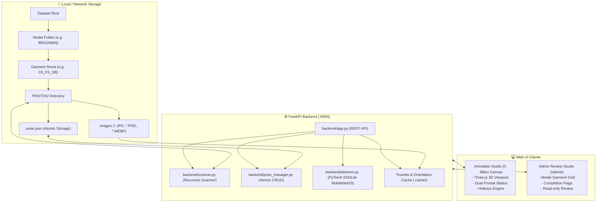

# 👗 Barbie 3D Body & Pose Visualizer

[](https://fastapi.tiangolo.com)
[](https://pytorch.org)
[](https://threejs.org)
[](https://python.org)
[]()
[]()

**Barbie 3D Body & Pose Visualizer** is a high-performance web-based visualizer and annotation suite tailored for fashion e-commerce catalogues, photoshoot production pipelines, and 3D human pose framing.

It enables annotators and dataset reviewers to quickly process photoshoot hierarchies, extract human subject bounding boxes with deep learning, align 3D body rotation angles across 360°, and specify head-to-toe vertical framing regions—all with real-time atomic persistence to `pose.json`.

---

## 📑 Table of Contents

- [Key Features](#-key-features)
- [System Architecture](#-system-architecture)
- [Directory & Dataset Hierarchy](#-directory--dataset-hierarchy)
- [Quick Start Guide](#-quick-start-guide)
  - [macOS / Linux](#macos--linux)
  - [Windows (WSL / WSL2)](#windows-wsl--wsl2)
- [User Guide](#-user-guide)
  - [1. Annotator Studio (`/`)](#1-annotator-studio-)
  - [2. Admin Review Studio (`/admin`)](#2-admin-review-studio-admin)
- [Keyboard Shortcuts](#-keyboard-shortcuts)
- [pose.json Specification](#-posejson-specification)
- [REST API Reference](#-rest-api-reference)
- [Performance & Optimization](#-performance--optimization)
- [Automated Testing](#-automated-testing)
- [Troubleshooting & FAQ](#-troubleshooting--faq)

---

## ✨ Key Features

### 🖼️ Arbitrary-Depth Photoshoot Scanner
- Automatically discovers folders named `PHOTOS` or `photos` at **any depth** in your directory tree (e.g. `20241027/BENJAMIN/03_FS_SB/PHOTOS` or `nested/deep/.../PHOTOS`).
- Supports both POSIX Linux/macOS paths and native Windows drive formats (`C:\Users\...` translated to `/mnt/c/Users/...`).
- Automatically handles DSLR EXIF orientation flags, rotating portrait images vertically to avoid sideways views.

### 📐 3-Panel Visualizer Studio
1. **Original Photo with Interactive BBox Canvas**:
   - Smooth mouse drag-to-draw bounding box with 8 interactive resize handles.
   - Real-time readout of both pixel coordinates and normalized `[0.0, 1.0]` coordinates.
   - ⚡ **AI Person Auto-Detector**: Uses PyTorch **SSDLite MobileNetV3 Large** to detect the human model from head to toe in milliseconds (<20-50ms), resilient to studio shadows and gradient backdrops, with an OpenCV contour-based fallback.
2. **Interactive 3D Body Rotation Viewport**:
   - Interactive Three.js viewport hosting rigged 3D models (**RenderPeople Nathan** for Male, **Sophia** for Female).
   - Seamless 360° horizontal rotation with live angle badges and cardinal orientation buttons (Front 0°, 3/4 R 45°, Right 90°, Back 180°, Left 270°, 3/4 L 315°).
3. **Head-to-Toe Frontal Pose & Dual Vertical Sliders**:
   - Frontal anatomical reference image with two draggable horizontal boundaries (Cyan Top Slider and Rose Bottom Slider).
   - Real-time anatomical region classification: `head`, `neck`, `chest`, `waist`, `hips`, `mid_thigh`, `knee`, `calf`, `ankle`, `foot`.
   - Framing presets: `Full (0-100%)`, `3/4`, `Upper`, `Torso`, `Lower`.

### 👔 Folder-Level Garment Setup & Propagation
- Photoshoots feature a single human subject wearing the same garment pair.
- Fitting tags (`top_fit`: `loose` | `regular` | `tight`; `bottom_fit`: `loose` | `regular` | `tight`) are configured **once per folder** and fixed at the root level of `pose.json`.
- ⎘ **"Same as Previous"** (`S` or `P` key): Clones the previous photo's bounding box, 3D angle, and dual sliders in a single click or keystroke.

### 🛡️ Admin Review Studio (`/admin`)
- High-level oversight for production managers and dataset leads.
- Scans entire model folders (e.g., `date/model_name/`) to list all garment types, their first photo thumbnails, and annotation completion percentages.
- Interactive completion toggle (`Complete` / `Incomplete`) stored directly in `pose.json`.
- Read-only review mode to inspect all annotated photos without modifying data.

### 💾 Safe & Atomic Persistence
- All changes are written via atomic file swaps (`pose.json.tmp` $\to$ `pose.json`) to guarantee zero corruption or partial write hazards.
- Clean JSON schema: image entries only retain image-specific geometry; folder-level fitting defaults and completion flags remain at root.
- **Strict Data Integrity**: Gender selection is retained exclusively in memory/session for 3D model rendering and is intentionally omitted from `pose.json`.

---

## 🏗️ System Architecture



---

## 📂 Directory & Dataset Hierarchy

The visualizer supports standard commercial fashion photoshoot folder hierarchies:

```text
dataset_root/
├── 20241027/
│   ├── BENJAMIN/                               <-- Model Folder
│   │   ├── 01_HS_SB/                           <-- Garment Type
│   │   │   └── PHOTOS/                         <-- Leaf Photoshoot Folder
│   │   │       ├── _1000101.JPG
│   │   │       ├── _1000102.JPG
│   │   │       └── pose.json                   <-- Auto-generated annotations
│   │   ├── 02_FS_SB/
│   │   │   └── PHOTOS/
│   │   │       └── ...
│   │   └── 03_FS_SB/
│   │       └── PHOTOS/
│   │           └── ...
│   └── SOPHIA/
│       └── ...
```

> **Note on Leaf Folders**: The scanner discovers any directory named `PHOTOS` or `photos` at arbitrary depth. You can scan `dataset_root`, `dataset_root/20241027`, or directly point to a single `.../PHOTOS` folder.

---

## 🚀 Quick Start Guide

### macOS / Linux

#### 1. Clone & Setup Environment
```bash
git clone https://github.com/your-username/barbie.git
cd barbie

# Create virtual environment
python3 -m venv .venv
source .venv/bin/activate

# Install dependencies
pip install --upgrade pip
pip install -r requirements.txt
```

#### 2. Run the Server
```bash
chmod +x run.sh
./run.sh
```

#### 3. Open in Browser
- **Annotator Studio**: [http://localhost:8000](http://localhost:8000)
- **Admin Review Studio**: [http://localhost:8000/admin](http://localhost:8000/admin)

---

### Windows (WSL / WSL2)

For Windows users running Ubuntu or Debian on WSL2:

#### 1. Run Automated WSL Installer
Inside your WSL terminal, run the automated setup script:
```bash
cd /path/to/barbie
chmod +x install_wsl.sh run_wsl.sh
./install_wsl.sh
```
*The installer automatically updates apt packages, installs OpenGL/GLib libraries, sets up `.venv`, installs PyTorch with GPU/CUDA detection, pre-caches detector weights, and executes the test suite.*

#### 2. Launch Server in WSL
```bash
./run_wsl.sh
```

#### 3. Access from Windows
Open Chrome or Edge in Windows and navigate to:
- [http://localhost:8000](http://localhost:8000)
- [http://localhost:8000/admin](http://localhost:8000/admin)

> **💡 Windows Path Translation Tip**:
> You can paste native Windows paths directly into the UI path input bars!
> For example: `C:\Users\John\Photoshoots` is automatically translated to `/mnt/c/Users/John/Photoshoots`.

---

## 🖥️ User Guide

### 1. Annotator Studio (`/`)

1. **Scan Directory**: Enter the root folder path in the header and click **Scan Folders**.
2. **Select Photoshoot**: Use the folder dropdown to switch between discovered `PHOTOS` directories.
3. **Folder Garment Defaults**:
   - Set **Gender** (Nathan / Sophia) to pick the corresponding 3D mannequin.
   - Set **Top Fit** (`Loose`, `Regular`, `Tight`) and **Bottom Fit** (`Loose`, `Regular`, `Tight`). These values apply across all photos in this photoshoot.
4. **Open 3-Panel Visualizer**: Click on any photo card in the gallery grid.
5. **Annotate**:
   - **BBox**: Drag on the left photo to draw a box, click **⚡ Auto-Detect** (`A`), or press `Full`.
   - **3D Angle**: Click and drag horizontally across the middle 3D viewport, or click one of the cardinal angle buttons (`Front 0°`, `3/4 R 45°`, etc.).
   - **Vertical Sliders**: Drag the Cyan (top) and Rose (bottom) sliders on the right panel to bound the framed region of the subject.
6. **Save & Advance**:
   - Press **Enter** or click **Save & Next Photo →** to save to `pose.json` and advance to the next image.
   - Press **S** or **P** on the next image to apply **Same as Previous**.

---

### 2. Admin Review Studio (`/admin`)

1. **Enter Model Path**: Paste a model folder path (e.g. `/path/to/20241027/BENJAMIN`) or pick from the scanned models dropdown.
2. **Garment Overview**:
   - View all garment shoots for that model in a structured card grid.
   - See first photo thumbnails, total photos, and annotation progress.
   - Toggle the **Completion Switch** (Mark as Complete / Incomplete) on any card.
3. **Audit & Review**:
   - Click **Review Photos** on any garment to inspect annotated photos in read-only mode.
   - Click **Open in Annotator ↗** to jump directly into the 3-panel visualizer studio for corrections.

---

## ⌨️ Keyboard Shortcuts

| Shortcut | Context | Action |
| :---: | :---: | :--- |
| <kbd>Enter</kbd> or <kbd>→</kbd> | Visualizer Modal | **Save & Next Photo** |
| <kbd>←</kbd> | Visualizer Modal | **Previous Photo** |
| <kbd>S</kbd> or <kbd>P</kbd> | Visualizer Modal | **Same as Previous** (copy BBox, 3D angle, and sliders) |
| <kbd>A</kbd> | Visualizer Modal | **Auto-Detect Bounding Box** (AI human detector) |
| <kbd>C</kbd> | Visualizer Modal | **Clear Bounding Box** |
| <kbd>Esc</kbd> | Visualizer Modal | **Close Visualizer Modal** |
| <kbd>M</kbd> | Visualizer Modal / Studio | Switch 3D Model to **Male (Nathan)** |
| <kbd>F</kbd> | Visualizer Modal / Studio | Switch 3D Model to **Female (Sophia)** |
| <kbd>1</kbd> | Visualizer Modal / Studio | Set Top Fit: **Loose** |
| <kbd>2</kbd> | Visualizer Modal / Studio | Set Top Fit: **Regular** |
| <kbd>3</kbd> | Visualizer Modal / Studio | Set Top Fit: **Tight** |
| <kbd>4</kbd> | Visualizer Modal / Studio | Set Bottom Fit: **Loose** |
| <kbd>5</kbd> | Visualizer Modal / Studio | Set Bottom Fit: **Regular** |
| <kbd>6</kbd> | Visualizer Modal / Studio | Set Bottom Fit: **Tight** |

---

## 📄 `pose.json` Specification

`pose.json` is stored directly inside each `PHOTOS/` leaf directory:

```json
{
  "is_complete": true,
  "defaults_confirmed": true,
  "top_fit": "regular",
  "bottom_fit": "tight",
  "fitting": {
    "top": "regular",
    "bottom": "tight"
  },
  "updated_at": "2026-09-08T09:15:32.418290Z",
  "images": {
    "_1000101.JPG": {
      "bbox": {
        "x1": 512,
        "y1": 275,
        "x2": 3038,
        "y2": 5625,
        "norm_x1": 0.1281,
        "norm_y1": 0.0458,
        "norm_x2": 0.7594,
        "norm_y2": 0.9375,
        "width": 2526,
        "height": 5350,
        "confidence": 0.94
      },
      "rotation_angle": 45.0,
      "rotation_label": "Front-Right 3/4 (45°)",
      "sliders": {
        "top_y": 0.0,
        "bottom_y": 0.95,
        "top_y_px": 0,
        "bottom_y_px": 760,
        "top_region": "head",
        "bottom_region": "ankle",
        "framing": "three_quarter"
      },
      "updated_at": "2026-09-08T09:15:32.418290Z"
    }
  }
}
```

### Schema Rules & Guarantee
1. **Root-Level Defaults**: `top_fit`, `bottom_fit`, `fitting`, and `is_complete` are fixed once at the root level of the photoshoot.
2. **Clean Image Records**: Image entries under `"images"` only contain image-specific geometry (`bbox`, `rotation_angle`, `sliders`, `updated_at`). Redundant fields are strictly stripped.
3. **Gender Separation**: Gender is exclusively used for interactive 3D mannequin rendering and is intentionally **not** written to `pose.json`.

---

## 🔌 REST API Reference

| Method | Endpoint | Description |
| :--- | :--- | :--- |
| `POST` | `/api/scan` | Recursively scan directory for `PHOTOS` folders |
| `GET` | `/api/folder?path=...` | Retrieve images, annotations, and defaults for a specific `PHOTOS` directory |
| `POST` | `/api/folder_defaults` | Save photoshoot-level fitting defaults (`top_fit`, `bottom_fit`) |
| `POST` | `/api/folder/complete` | Toggle completion status (`is_complete: true/false`) for a folder |
| `POST` | `/api/pose` | Save or update an individual photo's pose (`bbox`, `rotation_angle`, `sliders`) |
| `POST` | `/api/detect_bbox` | Execute SSDLite neural human bounding box detection on an image |
| `POST` | `/api/admin/model` | Scan all garment types under a model folder with completion metrics |
| `POST` | `/api/admin/scan_models` | Discover all model directories under a root path |
| `GET` | `/api/thumb?path=...&max_dim=500` | Fast Lanczos downsampled thumbnail with disk caching |
| `GET` | `/api/image?path=...` | Full-resolution oriented image with EXIF transpose |
| `GET` | `/api/health` | Health check endpoint |

---

## ⚡ Performance & Optimization

- **Deep Learning Model Caching**: The MobileNetV3 SSDLite detector weights are loaded into memory once on startup; inference takes <20-50ms per frame.
- **Orientation Normalization**: High-resolution DSLR images with EXIF rotation tags are normalized on the fly and cached under `.cache/oriented_images/` to prevent memory thrashing.
- **Thumbnail Caching**: Responsive Lanczos thumbnails are generated on demand and indexed by MD5 hash and modification timestamp under `.cache/thumbs/`.
- **Three.js WebGL Performance**: The 3D viewport utilizes low-overhead FBX meshes with compressed 2K textures, achieving 60 FPS in modern browsers.

---

## 🧪 Automated Testing

The project includes an automated test suite covering recursive scanning, atomic CRUD persistence, AI bounding box detection, image orientation normalization, WSL path translation, and admin model aggregation.

Run tests using `unittest`:

```bash
python -m unittest discover tests -v
```

Expected output:
```text
test_admin_api_endpoints (test_admin.TestAdmin) ... ok
test_completion_flag_persistence (test_admin.TestAdmin) ... ok
test_empty_admin_scan_returns_empty (test_admin.TestAdmin) ... ok
test_scan_model_garments (test_admin.TestAdmin) ... ok
test_scan_models_discovery (test_admin.TestAdmin) ... ok
test_detect_bbox (test_backend.TestBackend) ... ok
test_empty_scan_returns_empty (test_backend.TestBackend) ... ok
test_folder_defaults (test_backend.TestBackend) ... ok
test_folder_details_with_bbox (test_backend.TestBackend) ... ok
test_normalize_path_wsl (test_backend.TestBackend) ... ok
test_orient_image_vertical (test_backend.TestBackend) ... ok
test_photos_folder_json_format (test_backend.TestBackend) ... ok
test_pose_manager_crud (test_backend.TestBackend) ... ok
test_recursive_scanner (test_backend.TestBackend) ... ok
test_save_and_completion_progression (test_multifolder.TestMultiFolderFlow) ... ok
test_scan_and_defaults (test_multifolder.TestMultiFolderFlow) ... ok

----------------------------------------------------------------------
Ran 16 tests in 1.50s

OK
```

---

## ❓ Troubleshooting & FAQ

### 1. I am running inside WSL2 and cannot open `http://localhost:8000` in Windows.
- Ensure your server is bound to `0.0.0.0` (this is configured by default in `run_wsl.sh` and `run.sh`).
- If Windows Defender blocks localhost port forwarding, use your WSL IP:
  ```bash
  hostname -I
  ```
  Then open `http://<WSL_IP>:8000` in your Windows browser.

### 2. Can I use native Windows file paths in the UI?
Yes. You can paste `C:\Users\username\datasets` or `D:\shoots\20241027` into either the Annotator or Admin search bars. The backend automatically normalizes them to `/mnt/c/...` or `/mnt/d/...`.

### 3. Why is `gender` not saved inside `pose.json`?
Each photoshoot contains a single human wearing garments, and the pose estimation output strictly requires physical geometry (`bbox`, 3D angle, and vertical sliders) and garment fitting parameters (`top_fit`, `bottom_fit`). The gender setting selects the 3D mannequin (Nathan vs Sophia) and is kept strictly in-memory per session.

### 4. How do I enable GPU acceleration for human subject detection?
If you have an NVIDIA GPU, install PyTorch with CUDA support:
```bash
pip install torch torchvision --index-url https://download.pytorch.org/whl/cu124
```
`detector.py` automatically utilizes CUDA if available, falling back to CPU if no GPU is detected.

---

## 📜 License

Internal Proprietary Tool. Developed for Fashion Studio Photoshoot & Pose Estimation Workflows.
All rights reserved.
